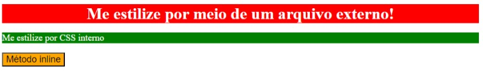

# Métodos para adicionar CSS
Neste exercício, você praticará a adição de CSS a um arquivo HTML usando todos os três métodos: CSS externo, CSS interno e CSS embutido. Você só deve usar seletores de tipo neste exercício ao adicionar estilos por meio de métodos externos e internos. Você também deve usar palavras-chave para cores (por exemplo, “azul”) em vez de usar valores RGB ou HEX.

Existem três elementos aos quais você pode adicionar estilos, cada um dos quais usa um método diferente de adição de CSS, conforme observado na imagem final abaixo. Todos os outros exercícios nesta seção terão um arquivo CSS fornecido e vinculado para você, mas para este exercício você mesmo terá que criar o arquivo e vinculá-lo ao arquivo HTML. Trata-se de praticar o uso desses diferentes métodos e acertar a sintaxe.

> ## Dica:
> Não se preocupe com detalhes desses exercícios que não sejam mencionados especificamente na seção de exercícios ou de autoavaliação. Como os resultados desejados são capturas de tela, seu navegador pode mostrar uma fonte diferente, as cores podem parecer diferentes em sua máquina ou o espaçamento entre os elementos pode parecer diferente. Preocupe-se apenas com os itens específicos que você deve aprender para cada exercício.

As propriedades que você precisa adicionar em cada elemento são:

* `div`: Cor de fundo vermelha, cor do texto branca, fonte de tamanho 32px, alinhado ao centro e texto em negrito 
* `p`: Cor de fundo verde, texto branco, fonte de tamanho 18 px
* `button`: Cor de fundo laranja, tamanho da fonte 18px

## Resultado

### Checkup
- Você usou todos os três métodos para adicionar CSS a um arquivo HTML?
- Você vinculou corretamente o arquivo CSS externo no arquivo HTML?
- O elemento `div` possui CSS adicionado através do método externo?
- O elemento `p` possui CSS adicionado através do método interno?
- O elemento `button` tem CSS adicionado através do método inline?